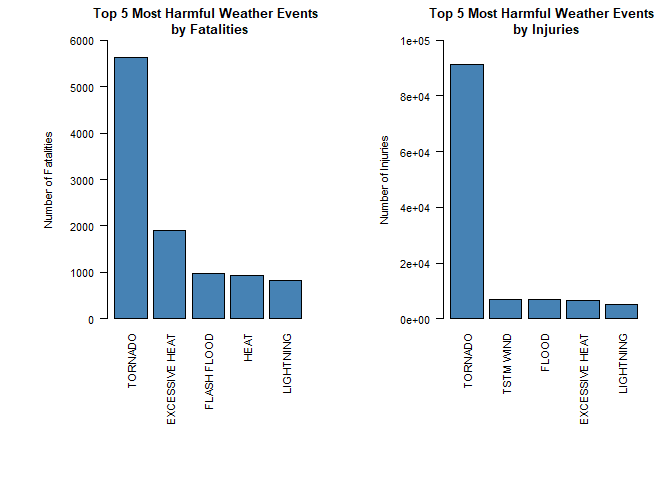
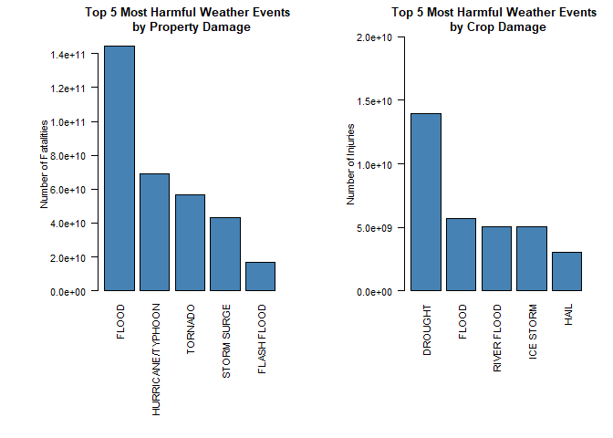

# **Population health and economic consequences of severe weather events** 
***

## Synopsis
***
The objective of this analysis is to explore the NOAA Storm Dataset to understand which types of weather events are most harmful with respect to population health. The study will also assess economic consequences of various types of events. The goal of this analysis is to produce results that may ultimately be guide the formulation of public policy formulation to minimize the impact of severe weather events. 

## Data Pre-processing
***
### Download and load source file
This code chunk downloads the source file directly from the download link. It then assigns the dataframe to storm2.

```r
if (!file.exists("repdata_data_StormData.csv.bz2")) {
  download.file("https://d396qusza40orc.cloudfront.net/repstorm2%2Fstorm2%2FStormstorm2.csv.bz2",
                destfile = "repdata_data_StormData.csv.bz2")
}
storm <- read.csv("repdata_data_StormData.csv.bz2")
```

### Clean dataset
This chunk removes all summary rows (ie. non-numeric) from STATE__. These rows are irrelevant to the analysis.

```r
storm$STATE__ <- as.numeric(storm$STATE__)
storm2 <- storm[!grepl("^summary.",tolower(storm$EVTYPE)),]
```

### Clean crop damage data
Create CROPMULTIPLIER column with value based on symbol in CROPDMGEXP. Values are assigned based on key-value relationship stated in dataset documentation. Then create CROPDMGTL variable which contains the absolute crop damage value for each weather event.

```r
# Assigning values for the crop exponent storm2 
storm2$CROPMULTIPLIER[storm2$CROPDMGEXP == "M"] <- 1e+06
storm2$CROPMULTIPLIER[storm2$CROPDMGEXP == "K"] <- 1000
storm2$CROPMULTIPLIER[storm2$CROPDMGEXP == "m"] <- 1e+06
storm2$CROPMULTIPLIER[storm2$CROPDMGEXP == "B"] <- 1e+09
storm2$CROPMULTIPLIER[storm2$CROPDMGEXP == "0"] <- 1
storm2$CROPMULTIPLIER[storm2$CROPDMGEXP == "k"] <- 1000
storm2$CROPMULTIPLIER[storm2$CROPDMGEXP == "2"] <- 100
storm2$CROPMULTIPLIER[storm2$CROPDMGEXP == ""] <- 1
# Assigning '0' to invalid exponent storm2
storm2$CROPMULTIPLIER[storm2$CROPDMGEXP == "?"] <- 0
# calculating the crop damage value
storm2$CROPDMGTL <- storm2$CROPDMG * storm2$CROPMULTIPLIER
```

### Prepare dataset for health assessment
Create dataframe of total fatalities and injuries for each weather event type. Data from these dataframes will be used to create plots for public health impact assessment.

```r
# Fatalities
tl <- with(storm2, tapply(FATALITIES, EVTYPE, sum, na.rm=TRUE))
tl_df <- data.frame(EVTYPE=rownames(tl),FATALITIES=tl)
rownames(tl_df) <- NULL
idx <- sort(tl_df$FATALITIES, index.return=TRUE, decreasing=TRUE)$ix
storm2_fatalities <- tl_df[idx, c("EVTYPE", "FATALITIES")]

# Injuries
tl <- with(storm2, tapply(INJURIES, EVTYPE, sum, na.rm=TRUE))
tl_df <- data.frame(EVTYPE=rownames(tl),INJURIES=tl)
rownames(tl_df) <- NULL
idx <- sort(tl_df$INJURIES, index.return=TRUE, decreasing=TRUE)$ix
storm2_injuries <- tl_df[idx, c("EVTYPE", "INJURIES")]
```

### Clean property damage data
Create PROPMULTIPLIER column with value based on symbol in PROPDMGEXP. Values are assigned based on key-value relationship stated in dataset documentation. Then create PROPDMGTL variable which contains the absolute property damage value for each weather event.

```r
# Assigning values for the property exponent storm2 
storm2$PROPMULTIPLIER[storm2$PROPDMGEXP == "K"] <- 1000
storm2$PROPMULTIPLIER[storm2$PROPDMGEXP == "M"] <- 1e+06
storm2$PROPMULTIPLIER[storm2$PROPDMGEXP == ""] <- 1
storm2$PROPMULTIPLIER[storm2$PROPDMGEXP == "B"] <- 1e+09
storm2$PROPMULTIPLIER[storm2$PROPDMGEXP == "m"] <- 1e+06
storm2$PROPMULTIPLIER[storm2$PROPDMGEXP == "0"] <- 1
storm2$PROPMULTIPLIER[storm2$PROPDMGEXP == "5"] <- 1e+05
storm2$PROPMULTIPLIER[storm2$PROPDMGEXP == "6"] <- 1e+06
storm2$PROPMULTIPLIER[storm2$PROPDMGEXP == "4"] <- 10000
storm2$PROPMULTIPLIER[storm2$PROPDMGEXP == "2"] <- 100
storm2$PROPMULTIPLIER[storm2$PROPDMGEXP == "3"] <- 1000
storm2$PROPMULTIPLIER[storm2$PROPDMGEXP == "h"] <- 100
storm2$PROPMULTIPLIER[storm2$PROPDMGEXP == "7"] <- 1e+07
storm2$PROPMULTIPLIER[storm2$PROPDMGEXP == "H"] <- 100
storm2$PROPMULTIPLIER[storm2$PROPDMGEXP == "1"] <- 10
storm2$PROPMULTIPLIER[storm2$PROPDMGEXP == "8"] <- 1e+08
# Assigning '0' to invalid exponent storm2
storm2$PROPMULTIPLIER[storm2$PROPDMGEXP == "+"] <- 0
storm2$PROPMULTIPLIER[storm2$PROPDMGEXP == "-"] <- 0
storm2$PROPMULTIPLIER[storm2$PROPDMGEXP == "?"] <- 0
# Calculating the property damage value
storm2$PROPDMGTL <- storm2$PROPDMG * storm2$PROPMULTIPLIER
```

### Prepare dataset for economic assessment
Create dataframes of total property and crop damage value for each weather event type. Data from these dataframes will be used to create plots for economic impact assessment.

```r
prop_dmg <- aggregate(PROPDMGTL~EVTYPE,data=storm2,FUN=sum)
prop_dmg <- prop_dmg[order(prop_dmg$PROPDMGTL,decreasing=TRUE),]

crop_dmg <- aggregate(CROPDMGTL~EVTYPE,data=storm2,FUN=sum)
crop_dmg <- crop_dmg[order(crop_dmg$CROPDMGTL,decreasing=TRUE),]
```

## Results
***
### Public Health Impact Assessment
Create a facet of 2 plots, 1) one that conveys the total fatalities per weather event type, 2) one that conveys the total injuries per weather event type. Plots are limited to only the top 5 weather events in terms of total fatalities and injuries. 

```r
# Plot Top 5 Fatalities
par(mfrow=c(1,2),mar=c(12,8,3,2),cex=0.7, mgp = c(4, 1, 0))
with(storm2_fatalities,barplot(FATALITIES[1:5],names.arg = EVTYPE[1:5],las=2,ylim=c(0,ceiling(max(FATALITIES)/1000)*1000),
                               main="Top 5 Most Harmful Weather Events \n by Fatalities",
                               ylab="Number of Fatalities",
                               col="steelblue"))

# Plot Top 5 Injuries
with(storm2_injuries,barplot(INJURIES[1:5],names.arg = EVTYPE[1:5],las=2,ylim=c(0,ceiling(max(INJURIES)/10000)*10000),
                              main="Top 5 Most Harmful Weather Events \n by Injuries",
                             ylab="Number of Injuries",
                             col="steelblue"))
```

<!-- -->

**Thus, the facet plot above shows that Tornados contributed most to injuries and fatalities in the United States since 1950. However, it is not clear whether this observation is consistent through time. It would be worthwhile to conduct the same analysis with time via a scatterplot. The severity of each weather event occurrence can also be explored by using averages instead of totals.**

### Economic Impact Assessment
Create a facet of 2 plots, 1) one that conveys the total property damage value per weather event type, 2) one that conveys the total crop damage value per weather event type. Plots are limited to only the top 5 weather events in terms of total property and crop damage.

```r
# Plot Top 5 Property Damage
par(mfrow=c(1,2),mar=c(12,8,3,2),cex=0.7, mgp = c(4, 1, 0))
with(prop_dmg,barplot(PROPDMGTL[1:5],names.arg = EVTYPE[1:5],las=2,ylim=c(0,ceiling(max(PROPDMGTL)/1e+10)*1e+10),
                               main="Top 5 Most Harmful Weather Events \n by Property Damage",
                               ylab="Number of Fatalities",
                               col="steelblue"))

# Plot Top 5 Crop Damage
with(crop_dmg,barplot(CROPDMGTL[1:5],names.arg = EVTYPE[1:5],las=2,ylim=c(0,ceiling(max(CROPDMGTL)/1e+10)*1e+10),
                              main="Top 5 Most Harmful Weather Events \n by Crop Damage",
                             ylab="Number of Injuries",
                             col="steelblue"))
```

<!-- -->

**Hence, the facet plot above shows that Floods caused the largest amount of property damage, in terms of value, in the United States since 1950. Though, Droughts were the primary cause for crop damage. Again, it is not clear whether these observations are  consistent through time. It would be worthwhile to conduct the same analysis with time via a scatterplot. Finally averages can be used, instead of totals, to explore the economic severity of each weather event occurrence.**
